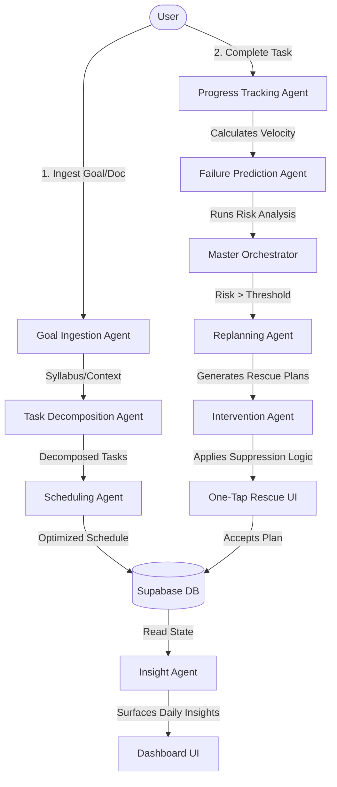

# NEXUS — The Autonomous Execution Operating System

NEXUS is an **Autonomous Execution Intelligence** platform that sits between reactive AI assistants and static project management tools. Designed as **"The Last-Minute Life Saver"** for the **Vibe2Ship Hackathon (Coding Ninjas × Google for Developers)**, NEXUS dynamically monitors your day-to-day progress, predicts failure risks before they happen, and generates **One-Tap Rescue Plans** to reorganize your roadmap.

---

## 🚀 Key Features

*   **Interactive 9-Agent Neural Network Panel**: Located at the absolute top of the dashboard, this interactive SVG visualization represents the real-time activity and flow of data packets across the 9-agent topology as they analyze goals and trigger schedule adjustments.
*   **Live SSE Token Thought Stream**: See exactly what the agents are thinking in real time. A live-scrolling terminal types out reasoning chains and pipeline updates as they happen.
*   **Voice Goal Intake**: Speak your goal details and timeline constraints naturally. NEXUS uses **Gemini 2.0 Flash** to parse your transcript and automatically extract onboarding variables (e.g., target title, daily available hours, target deadline).
*   **"Will I Make It?" Burn Rate Forecast Engine**: A dual-axis Recharts visualization plotting target trajectories alongside actual progress. It extrapolates your current velocity to forecast a projected completion date relative to your deadline.
*   **Ambient Status Orb**: A glowing interactive orb representing aggregate workspace health. It breathes green (healthy), amber (warning), or pulses red (critical) depending on active velocity deficits.
*   **Command Palette (`Cmd/Ctrl + K`)**: Instant access to system navigation, search queries, theme switching, demo seeding, and database resets.
*   **Fail-Safe Google Calendar Integration**: Auto-publishes scheduled study/work blocks onto your Google Calendar. Includes a settings toggle kill-switch to bypass expired OAuth token sync failures.
*   **Outreach & Reminders**: Dispatched through the Twilio sandbox for direct WhatsApp velocity notifications when the system predicts a deadline risk.

---

## 🛠️ Multi-Agent Architecture & Pipeline

NEXUS leverages a **9-Agent Pipeline** powered by **Gemini 2.0 Flash** and **Gemini 1.5 Pro** to manage your roadmaps:



### The 9 Autonomous Agents:
1.  **Master Orchestrator**: Coordinates event routing, logs execution flows, and triggers appropriate agent cycles.
2.  **Goal Ingestion Agent**: Processes goal inputs and parses syllabus/PRD documents to capture scope and constraints.
3.  **Task Decomposition Agent**: Breaks down raw goals and syllabi into atomic, actionable tasks organized by milestones.
4.  **Scheduling Agent**: Builds day-by-day task lists considering deadlines, available hours, and cognitive-load distribution.
5.  **Progress Tracking Agent**: Captures velocity on task completions, updating overall execution metrics.
6.  **Failure Prediction Engine**: Analyzes completion trends to compute failure probability percentages.
7.  **Replanning Agent**: Generates optimized recovery schedules (re-allocating pending tasks) when risk levels trigger alerts.
8.  **Intervention Agent**: Decides *when* and *how* to alert the user (with suppression rules to prevent notification fatigue).
9.  **Insight Agent**: Synthesizes daily performance trends into high-value cognitive feedback.

---

## 💻 Local Development Setup

### Prerequisites
- Node.js (v20+ recommended)
- PNPM (`npm i -g pnpm`)
- Python (3.11+)

### 1. Database Setup
Ensure you run all SQL files inside the [migrations/](file:///c:/Users/U/OneDrive/Laksh-Projects/Nexus/migrations) folder in your Supabase SQL Editor:
- **`20260627_agent_activity.sql`**: Configures agent logging and triggers.
- **`20260629_user_settings.sql`**: Configures notification settings.
- **`20260630_google_token_sync.sql`**: Persists Google OAuth integration properties.
- **`20260701_gemini_api_key.sql`**: Persists user-defined Gemini API keys.
- **`20260702_google_calendar_toggle.sql`**: Adds the calendar kill-switch settings parameter.

### 2. Environment Variables

- **Frontend Setup** (`.env.local` in root directory):
  ```env
  NEXT_PUBLIC_SUPABASE_URL=your_supabase_url
  NEXT_PUBLIC_SUPABASE_ANON_KEY=your_supabase_anon_key
  NEXT_PUBLIC_API_URL=http://localhost:8000
  ```

- **Backend Setup** (`.env` in `backend/` directory):
  ```env
  SUPABASE_URL=your_supabase_url
  SUPABASE_SERVICE_KEY=your_supabase_service_role_key
  GEMINI_API_KEY=your_gemini_api_key
  ENVIRONMENT=development
  FRONTEND_URL=http://localhost:3000
  TWILIO_ACCOUNT_SID=your_twilio_sid
  TWILIO_AUTH_TOKEN=your_twilio_token
  TWILIO_WHATSAPP_FROM=whatsapp:+14155238886
  TWILIO_WHATSAPP_TO=whatsapp:your_registered_number
  ```

### 3. Execution Commands
Install dependencies:
```bash
pnpm install
cd backend
pip install -r requirements.txt
cd ..
```

Start the Next.js and FastAPI servers concurrently:
```bash
pnpm dev:all
```
- **Frontend URL**: [http://localhost:3000](http://localhost:3000)
- **Backend URL**: [http://localhost:8000](http://localhost:8000)

---

## ⚡ Demo Walkthrough Metrics
To showcase the system quickly during a 2.5-minute demo:
1.  Click the **Load Demo Data** button in the sidebar footer (or via `Ctrl+K` Command Palette).
2.  Your health score will initialize to **62** (warning zone) and surface an active intervention notifying you of a **68% failure risk** (due to missing 6 days of velocity).
3.  Click **Accept Rescue Plan** on the dashboard card.
4.  Watch the confetti burst as the health score jumps from **62** to **79** (safe zone) with your schedule rearranged automatically!

---

## 🐳 Docker Deployment & Cloud Run

Build and run containerized environments locally:
```bash
docker-compose up --build
```

Submit builds directly to Google Cloud Build & Google Cloud Run:
```bash
gcloud builds submit --config=cloudbuild.yaml \
  --substitutions=_SUPABASE_URL="your_url",_SUPABASE_SERVICE_KEY="your_key",_GEMINI_API_KEY="your_api_key",_FRONTEND_URL="frontend_url",_NEXT_PUBLIC_SUPABASE_URL="your_url",_NEXT_PUBLIC_SUPABASE_ANON_KEY="your_anon_key",_NEXT_PUBLIC_API_URL="backend_url"
```
